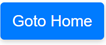
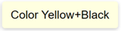
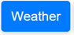
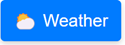
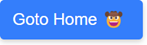

# SsrButton Component for Blazor

## Overview

The `SsrButton` is a versatile and customizable button component for Blazor applications. It supports both server-side rendering (SSR) and client-side rendering, making it ideal for use in various Blazor project types.

## Features

- Customizable button text and color
- Support for icons through RenderFragment
- Flexible URL handling (relative and absolute URLs)
- Compatible with both SSR and client-side rendering

## Getting Started
[Demo](https://blazorssrbuttondemo.azurewebsites.net/)

### Installation

 - Install the latest NuGet Package

 Using Package Manager
```
Install-Package Blazor.SsrButton
```

 Using .NET CLI
```
dotnet add package Blazor.SsrButton
```

 Using MS VS Manage NuGet packages, search for `Blazor.SsrButton`


### Usage
Here's how to use the `SsrButton` component in your Blazor pages or components:
>Note: Don't forget to add `@using Blazor.SsrButton`

- Simple: current page as target.
 
 ```html
 <SsrButton Text="Goto Home"/>
 ```
- Change Colors
 
 ```html
 <SsrButton Text="Color Yellow+Black" BgColor="#FFFFE0" TextColor="#000000"/>
 ```
- Use relative URL. Go to the `weather' route for the current location

 ```html
 <SsrButton Text="Weather" Href="weather"/>
 ```
- Use relative URL with unicode icon *( or as code `&#9925;`)*

 ```html
 <SsrButton Text="Weather" Href="weather">
    <IconTemplate>
      <span>⛅</span>
    </IconTemplate>
</SsrButton>
 ```
- With image icon and absolute URL.
 ```html
 <SsrButton Href="https://example.com" ButtonText="Counter" BgColor="#4CAF50">
    <IconTemplate>
        
    </IconTemplate>
 </SsrButton>
 ```


#### Component Parameters

- `Href` (string): The URL the button should link to. Can be relative or absolute.
- `Text` (string): The text to display on the button.
- `BgColor` (string): The background color of the button (CSS color value).
- `TextColor` (string): The text color of the button (CSS color value). Default `white`
- `Parameters` (List<(string Key, string Value)>): Additional query parameters
- `IconTemplate` (RenderFragment): Optional icon content to display before the button text.

#### `Parameters` and URL-based State Management

The `SsrButton` component does not directly handle events; instead, it navigates to different URLs with query parameters to simulate state changes. For example, the well-known Blazor counter can operate in SSR mode too by updating the URL with a new count parameter on each click.  However, this method results in a complete page reload, which may impact responsiveness compared to client-side interactivity. 

>Note:To enhance security, you can sign parameters to prevent user modifications via the address bar.


### `Parameters` example


```html
@inject NavigationManager NavigationManager

<h2>Counter '@Id'</h2>

<p>Current count: @_currentCount</p>

<SsrButton 
    Text="Click me" 
    Parameters="dynamicParameters" 
/>

@code {
    [Parameter] public string Id { get; set; } = "";
    private int _currentCount = 0;

    private DynamicParameters dynamicParameters { get; set; } = new DynamicParameters();

    protected override void OnInitialized()
    {
        var uri = new Uri(NavigationManager.Uri);
        var query = System.Web.HttpUtility.ParseQueryString(uri.Query);
        
        if (int.TryParse(query[$"count_{Id}"], out int count))
        {
            _currentCount = count;
        }

        dynamicParameters.AddParameter($"count_{Id}", (_currentCount + 1).ToString());
    }
}
```

How does it work?

**1. Component Structure:**

- **Injection:**
  - `@inject NavigationManager NavigationManager`: Injects the `NavigationManager` service to access URL information.

- **Counter Display:**
  - `<h2>Counter '@Id'</h2>`: Displays a heading with the `Id` parameter.
  - `<p>Current count: @_currentCount</p>`: Shows the current count.

- **Button:**
  - `<SsrButton ... />`: Renders a button with dynamic parameters.

**2. Code Block:**

- **Parameter:**
  - `[Parameter] public string Id { get; set; } = "";`: Defines an `Id` parameter for the component.

- **State:**
  - `private int _currentCount = 0;`: Stores the current count.
  - `private DynamicParameters dynamicParameters = new DynamicParameters();`: Stores dynamic parameters for the button.

- **OnInitialized:**
  - **Parsing URL Query:**
    - Extracts the query string from the current URL.
    - Tries to parse the `count_{Id}` parameter from the query string.
    - If successful, updates the `_currentCount` state.

  - **Updating Dynamic Parameters:**
    - Increments the `_currentCount`.
    - Adds the updated `count_{Id}` parameter to the `dynamicParameters` object.
    - Handles other parameters as needed (not shown in the code snippet).

**Functionality:**

1. **Initial Render:**
   - The component renders with the initial `_currentCount` value (0).
2. **Button Click:**
   - The `SsrButton` is clicked.
   - The `dynamicParameters` are passed to the server-side rendering process.
   - The server-side logic processes the parameters, including the updated `count_{Id}`.
   - The browser navigates to a new URL, for example: 
     `https://localhost:7252/counter-ssr?count_id1=1`
   - This triggers a new request to the server with the updated query parameter.

3. **Server-Side Rendering:**
   - The server receives the new request with the updated URL.
   - The `OnInitialized` method is called again, parsing the new URL.
   - It extracts the new count value from the query string (`count_id1=1`).
   - The `_currentCount` is updated with this new value.
   - The server renders the component with the updated `_currentCount` value.

4. **Client-Side Update:**
   - The browser receives a complete new HTML page from the server.
   - The entire page is reloaded, replacing the previous content.
   - The new page includes the updated counter component with the new count.
   - The UI reflects the new count as part of this full page refresh.


The entire page, including the updated counter component, is rendered on the server and sent to the client as a complete HTML document.
This process leverages server-side rendering to update the component state, ensuring that the counter value persists across page reloads and can be shared via URL. Each click essentially results in a new page load with an incremented counter value in the URL, which is then used to update the component's state.
**Key Points:**

- **URL-Based State:** The component leverages the URL query string to persist state across page loads and browser sessions.
- **Server-Side Rendering:** The `SsrButton` ensures that the button click and state update are handled on the server, providing a more reliable and consistent user experience.
- **Dynamic Parameters:** The `dynamicParameters` object allows for flexible parameter passing to the server-side rendering process.

**Additional Considerations:**

- **Security:** Ensure proper validation and sanitization of URL parameters to prevent potential security vulnerabilities like cross-site scripting (XSS).
- **Error Handling:** Implement error handling mechanisms to gracefully handle cases where the `count_{Id}` parameter is not found or cannot be parsed.
- **Performance:** For large-scale applications, consider optimization techniques to minimize server-side rendering overhead, such as caching and code splitting.


## Additional Styling

If you want to change the position of the icon, add the following CSS to your stylesheet:


```css
.button-icon {
    margin-left: 5px; /* Adds space to the left side of the icon */
    order: 1; /* Moves the icon to the end of the flex layout */
}

```

## Contributing

Contributions are welcome! Please feel free to submit a Pull Request.


